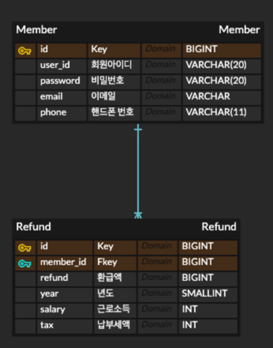
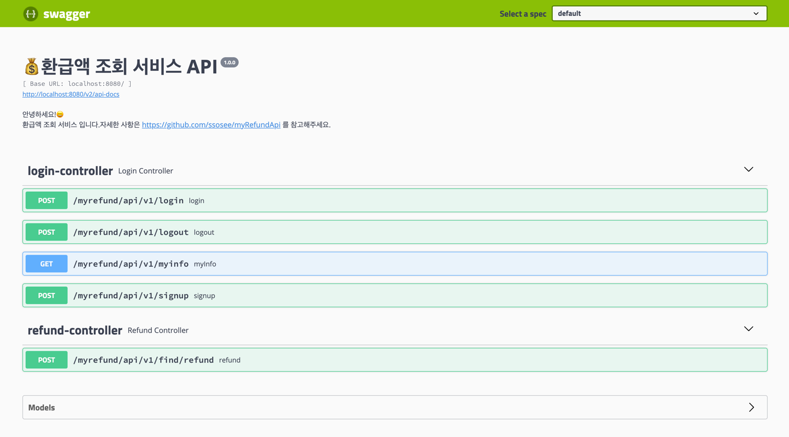
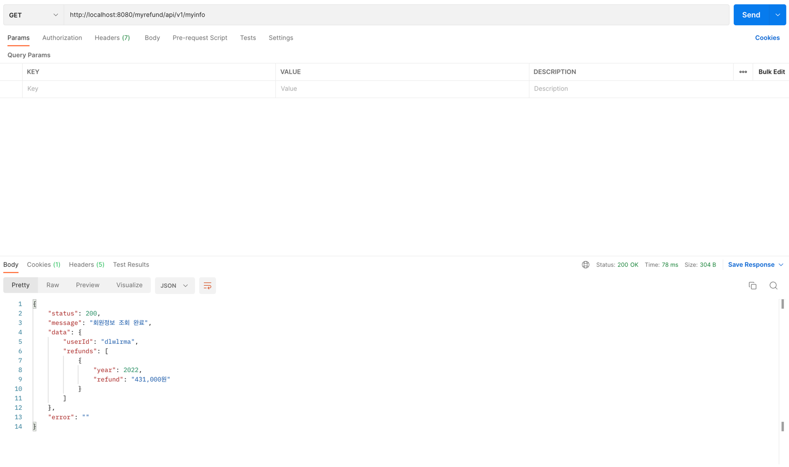
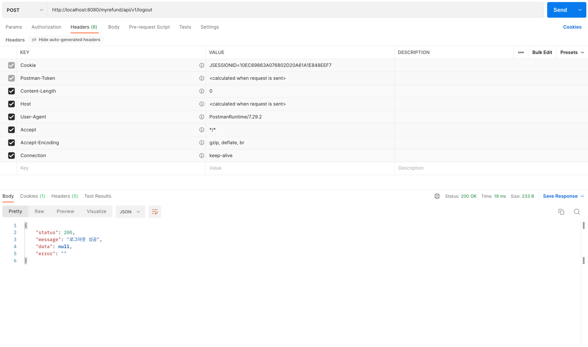

# 💰 환급액 조회 서비스
**목표: REST API 개발 역량 강화**

## 기술 스택

 

## 개요
사용자의 근로소득(연간)과 납부세액 입력하면 예상 환급액을 조회하는 서비스 개발

## 원리
<a href="https://www.nts.go.kr/nts/cm/cntnts/cntntsView.do?mi=6596&cntntsId=7875">참고#1</a>

<a href="https://blog.3o3.co.kr/220517-insight/">참고#2</a>

**세액공제액 - 납부세액 > 0 ? 환급액 없음 : 환급액 있음**
* 근로소득 -> 과세표준
* 납부세액 -> 기납부세액
* 산출세액 = 과제표준 * 누진세율
* 세액공제액 = min(산출세액 공제액, 근로소득 공제 한도)

## 요구사항
1. 회원 가입
2. 로그인
3. 회원정보 조회
   1. 환급액을 조회한 이력이 있는 경우 회원정보 조회시 환급액을 볼수 있어야함
4. 환급액 조회
   1. 환급액 계산에 필요한 정보를 받으면 환급액을 조회한다.

## [기능](https://github.com/ssosee/myRefundApi/blob/master/API-Doc.md)
* 회원가입
* 로그인
* 회원 정보 조회
* 환급액 조회

## DB(ERD)

## 결과
### Swagger
주소: http://localhost:8080/swagger-ui.html

### PostMan
#### 회원가입

#### 로그인

#### 회원정보 조회

#### 환급액 조회

#### 로그아웃
